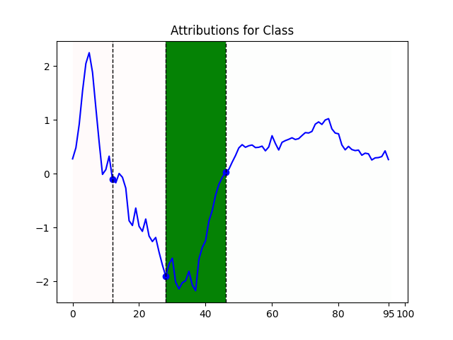

# iSee-LIMESegment

This is a packaged version of **LIMESegment** (https://github.com/TortySivill/LIMESegment/), a time series explainer written by Torty Sivill.  Please check this repository for detailed information about how LIMESegment can deliver "Meaningful, Realistic Time Series Explanations". 

This package is part of the iSee project (https://isee4xai.com/), an open-source platform for sharing AI explanation experiences across multiple users and use cases.

## How to install this package

Install this package with the following `pip` command 

`pip install git+https://github.com/isee4xai/LIMESegment`


## How to use this package

```python
from LIMESegment.LIMESegmentExplainer import LIMESegmentExplainer

explainer = LIMESegmentExplainer()
explanation = explainer.explain (
                         example = instance, 
                         model = model,
                         model_type="proba",
                         window_size=10,
                         cp=3,
                         f=100
                         )

```

Input arguments:

<ul> 
  <li> instance: TS array of shape T x 1 where T is length of time series </li>
  <li> model: Trained model on dataset array of shape n x T x 1 </li>
  <li> model_type: String indicating if classificaton model produces binary output "class" or probability output "proba", default     "class" </li>
  <li> distance: Distance metric to be used by LIMESegment default is 'dtw' </li>
  <li> window_size: Window size to be used by NNSegment default is T/5 </li>
  <li> cp: Number of change points to be determinded by NNSegment default is 3 </li>
  <li> f: Frequency parameter for RBP default is T/10 </li>
 </ul> 


The returned variable `explanation` is a tuple containing:
* The segment importance vector as returned by LIMESegment
* the change points indices

## How to plot an explaation chart

```python
import matplotlib.pyplot as plt

fig, ax = plt.subplots()
explainer.plot_explanation (instance, explanation, ax=ax)

```

example:

